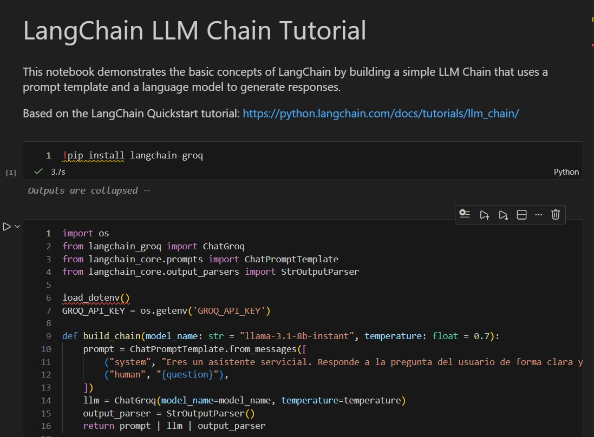
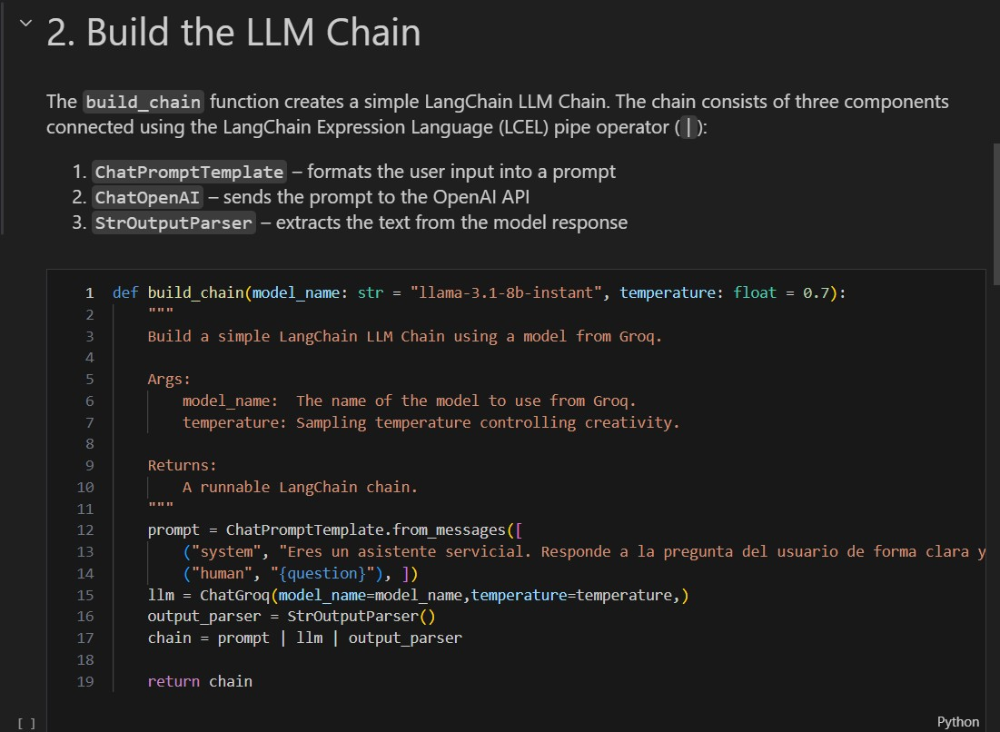
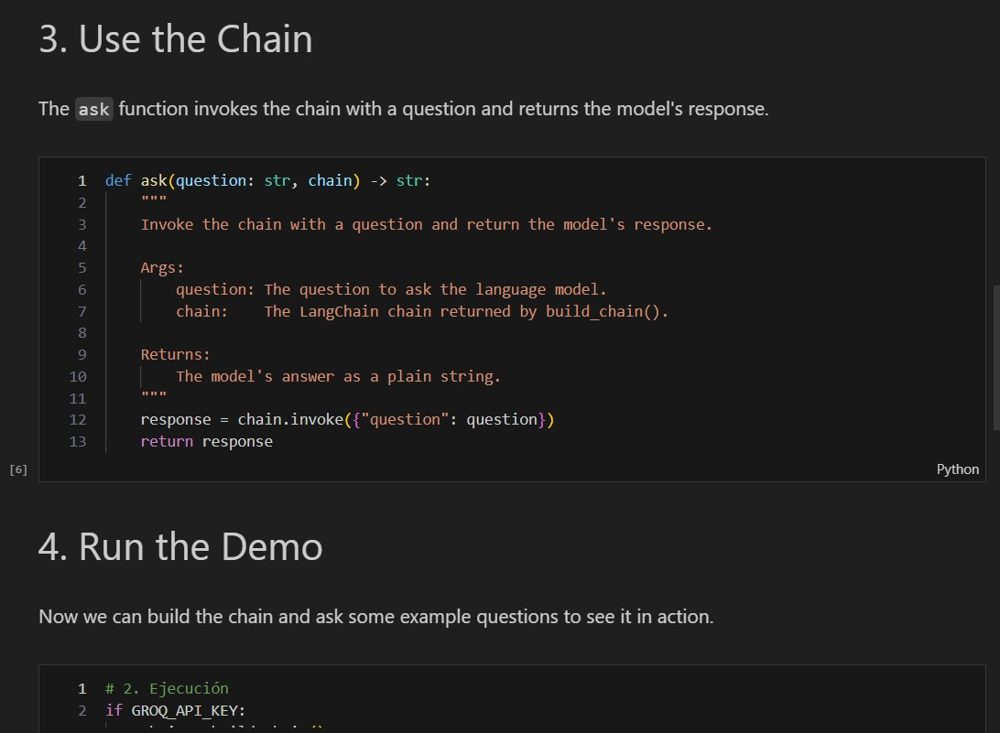
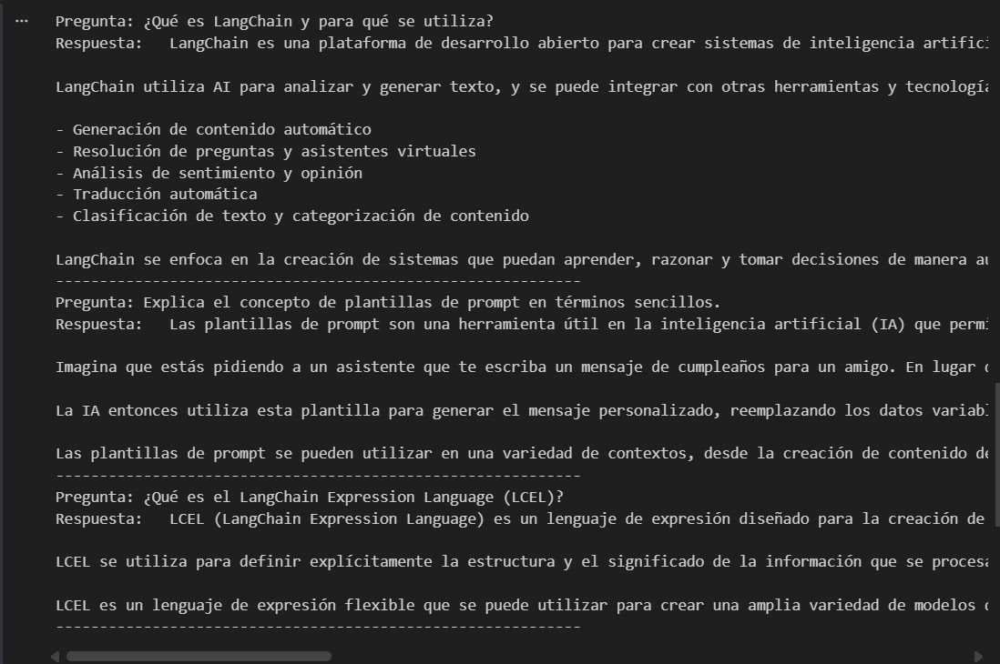

# LangChain Tutorial: Creating Chains with LLMs
author tomas felipe ramirez alvarez

A beginner-friendly implementation of the [LangChain LLM Chain Tutorial](https://python.langchain.com/docs/tutorials/llm_chain/), demonstrating how to build a simple conversational application using LangChain and the Groq API.

---

## Table of Contents

- [Project Architecture](#project-architecture)
- [Components](#components)
- [Prerequisites](#prerequisites)
- [Installation](#installation)
- [Configuration](#configuration)
- [Running the Code](#running-the-code)
- [Code Summary](#code-summary)
- [Example Output](#example-output)
- [References](#references)

---

## Project Architecture

```
┌─────────────────────────────────────────────────┐
│                  User Input                     │
│             (question / prompt)                 │
└───────────────────────┬─────────────────────────┘
                        │
                        ▼
┌─────────────────────────────────────────────────┐
│           ChatPromptTemplate                    │
│  Formats the question into a structured prompt  │
│  with a system message and a human message      │
└───────────────────────┬─────────────────────────┘
                        │
                        ▼
┌─────────────────────────────────────────────────┐
│               ChatGroq (LLM)                    │
│  Sends the formatted prompt to the Groq API     │
│  and returns an AIMessage object                │
└───────────────────────┬─────────────────────────┘
                        │
                        ▼
┌─────────────────────────────────────────────────┐
│            StrOutputParser                      │
│  Extracts plain text response from the         │
│  AIMessage returned by the model                │
└───────────────────────┬─────────────────────────┘
                        │
                        ▼
┌─────────────────────────────────────────────────┐
│                  Output                         │
│            (plain text response)                │
└─────────────────────────────────────────────────┘
```

The three components are connected using the **LangChain Expression Language (LCEL)** with the pipe operator (`|`):

```python
chain = prompt | llm | output_parser
```

---

## Components

| Component | Description |
|-----------|-------------|
| `ChatPromptTemplate` | Defines the structure of the prompt sent to the model. Combines a *system* message (sets the assistant's role) with a *human* message (the user's question). |
| `ChatGroq` | A wrapper for the Groq Chat API. Accepts the formatted prompt and returns a model response. |
| `StrOutputParser` | Converts the `AIMessage` object returned by the LLM into a simple Python string. |

---

## Prerequisites

- Python **3.9** or higher
- A **Groq API Key** ([you can create one here](https://console.groq.com/keys))

---

## Installation

1.  **Clone the repository**

    ```bash
    git clone https://github.com/TDSE-tomaspro/ntroduction_to_Creating_RAGs_1.git
    cd ntroduction_to_Creating_RAGs_1
    ```

2.  **Create a virtual environment** (recommended)

    ```bash
    python -m venv .venv
    # On Windows:
    .venv\Scripts\activate
    ```

3.  **Install dependencies**

    ```bash
    pip install -r requirements.txt
    ```

---

## Configuration

For this tutorial, we use the safest and most recommended way to manage our Groq API is by using a `.env` file.

### 1. Create the .env file

In the project root, create a file named `.env` and add your key:

```text
GROQ_API_KEY=your_groq_key_here
```

*Note: The `.env` file is already included in `.gitignore`, so it will never be uploaded to GitHub.*

### 2. Install additional dependencies

This method requires the `python-dotenv` library:

```bash
pip install python-dotenv
```

---

## Running the Code

1.  Open the `tutorial.ipynb` file in an editor compatible with Jupyter Notebooks (like VS Code).
2.  Ensure you have configured your `GROQ_API_KEY` as described above.
3.  Run each cell in the notebook sequentially from top to bottom.

The last cell will build the chain and execute it with three example questions, printing the answers directly in the cell output.

---

## Code Summary

### `tutorial.ipynb`

```python
# 1. Prompt Template — structures the conversation
prompt = ChatPromptTemplate.from_messages([
    ("system", "You are a helpful assistant. Answer the user's question clearly and concisely."),
    ("human", "{question}"),
])

# 2. Language Model — calls the Groq API
llm = ChatGroq(model="llama-3.1-8b-instant", temperature=0.7)

# 3. Output Parser — extracts text from the response
output_parser = StrOutputParser()

# 4. Chain — connects the three components using LCEL
chain = prompt | llm | output_parser

# 5. Invocation — executes the chain with a question
response = chain.invoke({"question": "What is LangChain?"})
```

**Key Functions:**

| Function | Description |
|----------|-------------|
| `build_chain(model_name, temperature)` | Builds and returns the LLM chain. |
| `ask(question, chain)` | Invokes the chain with a question and returns the response. |

---

## Example Output

```
Question: What is LangChain and what is it used for?
Answer:   LangChain is an open-source framework for building applications powered by large language models (LLMs). It provides tools and abstractions to create applications that can reason, act, and be customized with data.

It is used for:
* **Creating chatbots and virtual assistants:** LangChain makes it easy to build conversational interfaces.
* **Text summarization:** It can summarize long documents into concise overviews.
* **Question answering:** It can answer questions about a specific dataset or knowledge domain.
* **Text generation:** It can generate creative text like poems, scripts, or emails.
------------------------------------------------------------
...
```

---
## evidence
-  
-  
-  
- 
## References

- [LangChain LLM Chain Tutorial](https://python.langchain.com/docs/tutorials/llm_chain/)
- [LangChain Documentation](https://python.langchain.com/docs/introduction/)
- [LangChain Expression Language (LCEL)](https://python.langchain.com/docs/concepts/lcel/)
- [Groq API Documentation](https://console.groq.com/docs)
